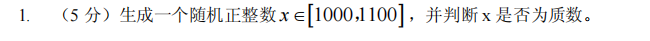
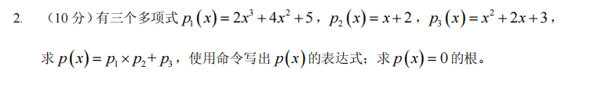
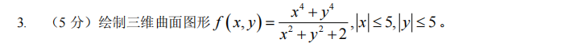
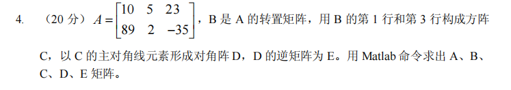
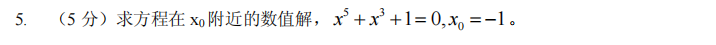
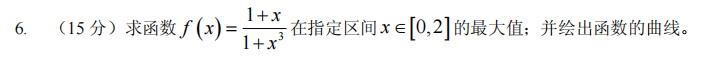
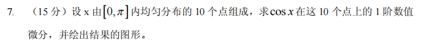
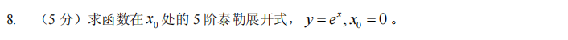
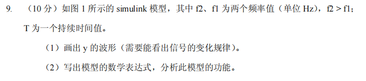
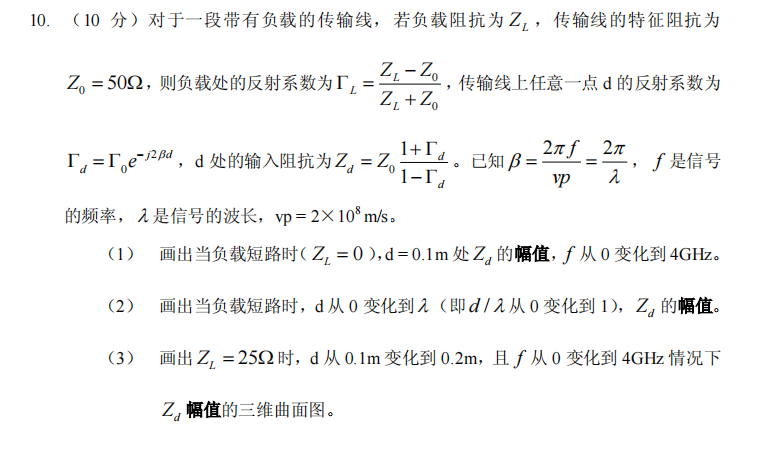

# 2019
## 1

```matlab
clc;clear;
format short;
x=999+randi(101);
flag=1;
for i=2:1:x/2
    if(mod(x,i)==0)
        flag=0;
        break
    end
end
sprintf("%d %d",x,flag)
```
## 2

```matlab
clc;clear;
p1=[2 4 0 5];
p2=[1 2];
p3=[1 2 3];
p=conv(p1,p2)+[0 0 p3];
syms x
f=@(x)polyval(p,x);
roots(p);
```
## 3

```matlab
clc;clear;
x=linspace(-5,5,100);
y=x;
[X,Y]=meshgrid(x,y);
f=(X.^4+Y.^4)./(X.^2+Y.^2+2);
mesh(X,Y,f)
```
## 4

```matlab
clc;clear;
A=[10,5,23;89 2 -35];
B=A';
C=[B(1,:);B(3,:)];
D=diag(diag(C));
E=inv(D);
```
## 5

```matlab
clc;clear;
f=@(x)x.^5+x.^3+1;
res=fzero(f,-1);
```
## 6

```matlab
clc;clear;
f=@(x)-(1+x)./(1+x.^3);
[x0,maxs]=fminbnd(f,0,2);
maxs=-maxs;
% fplot(-1*f,[0,2]);
x=linspace(0,2,1000);
plot(x,-f(x))
hold on;
plot(x0,maxs,"Marker","*","MarkerSize",10)
```
## 7

```matlab
clc;clear;
x=linspace(0,pi,10);
y=@(x)cos(x);
dy=diff(y([x,1.1*pi]));
stem(x,dy)

```
## 8

```matlab
clc;clear;
syms x;
y=exp(x);
res=taylor(y,x,0,"order",6);
```
## 9

```matlab
buhui


```
## 10

```matlab
clc;clear;
syms f d;
Z0=50;
Gl=-1;
Beta=2.*pi.*f./(2*10^8);
Gd=Gl*exp(-j.*2.*Beta.*d);
Zd=Z0.*(1+Gd)./(1-Gd);
Zd=subs(Zd,d,0.1);
fplot(abs(Zd),[0,4*10^9])

%% 2
clc;clear;
syms  k
Gd=-exp(-j.*2.*2*pi.*k);
Zd=50*(1+Gd)./(1-Gd);
fplot(abs(Zd),[0,1])
%% 3
clc;clear;
syms f d
Gl=(25-50)/(25+50);
Beta=2.*pi.*f./(2*10^8);
Gd=Gl*exp(-j.*2.*Beta.*d);
Zd=50.*(1+Gd)./(1-Gd);


fsurf(abs(Zd),[0.1 0.2 0 4*10^9])

xlabel("d")
ylabel("f")
zlabel("Zd")
```

