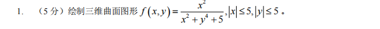
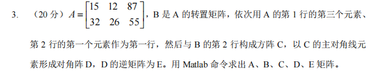

# 2020 试卷
## 1

```matlab
clc;clear;
x=linspace(-5,5,100);
y=linspace(-5,5,100);
[X,Y]=meshgrid(x,y);
f=X.^2./(X.^2+y.^4+5);
surf(X,Y,f)
```
************************
## 2

```matlab
clc;clear;
x=linspace(0,2*pi,100);
f=@(x)-sin(x).*x.^2;
[~,maxs]=fminbnd(f,0,2*pi);
maxs=-maxs;
```
************************
## 3

```matlab
clc;clear;
x=linspace(-5,5,100);
y=linspace(-5,5,100);
[X,Y]=meshgrid(x,y);
f=X.^2./(X.^2+y.^4+5);
surf(X,Y,f)
```
************************
## 1

```matlab
clc;clear;
x=linspace(-5,5,100);
y=linspace(-5,5,100);
[X,Y]=meshgrid(x,y);
f=X.^2./(X.^2+y.^4+5);
surf(X,Y,f)
```
************************
## 1

```matlab
clc;clear;
x=linspace(-5,5,100);
y=linspace(-5,5,100);
[X,Y]=meshgrid(x,y);
f=X.^2./(X.^2+y.^4+5);
surf(X,Y,f)
```
************************