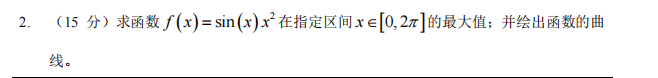
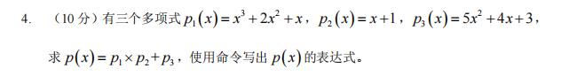
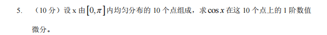
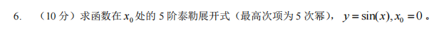
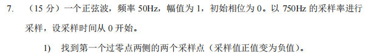
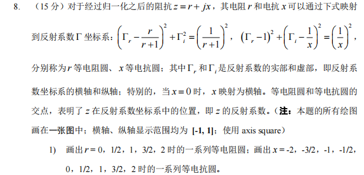
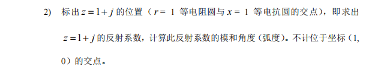
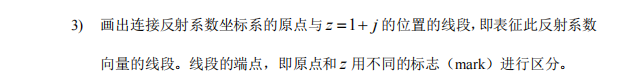

# 2020 试卷
## 1

```matlab
clc;clear;
x=linspace(-5,5,100);
y=linspace(-5,5,100);
[X,Y]=meshgrid(x,y);
f=X.^2./(X.^2+y.^4+5);
surf(X,Y,f)
```
************************
## 2

```matlab
clc;clear;
x=linspace(0,2*pi,100);
f=@(x)-sin(x).*x.^2;
[~,maxs]=fminbnd(f,0,2*pi);
maxs=-maxs;
```
************************
## 3

```matlab
clc;clear;
x=linspace(-5,5,100);
y=linspace(-5,5,100);
[X,Y]=meshgrid(x,y);
f=X.^2./(X.^2+y.^4+5);
surf(X,Y,f)
```
************************

## 4

```matlab
p1=[1,2,1,0];
p2=[1,0];
p3=[5,4,3];
p=conv(p1,p2)+[0 0 p3];
```
************************
## 5

```matlab
clc;clear;
x=linspace(0,pi,10);
f=@(x)cos(x);
res=diff(f([x,1.1*pi]));
```
************************
## 5

```matlab
clc;clear;
x=linspace(0,pi,10);
f=@(x)cos(x);
res=diff(f([x,1.1*pi]));
```
************************
## 6

```matlab
clc;clear;
syms x;
y=taylor(sin(x),x,0,"order",6);
```
************************
## 7


```matlab
%1
clc;clear;
fs=750;
F0=50;
T0=1/F0;
T=1/fs;
N=T0/T;
t=linspace(0,2*T0,2*N);
y=sin(2*pi*50*t);
plot(t,y,"-*")
dt=t(2)-t(1);
for i=1:N
    if y(i)*y(i+1)<0
        x0=[(i-1)*dt,i*dt i,i+1];
        break
    end
end
%2
xq=linspace(x0(1),x0(2),200000000);
vq=interp1(x0(1:2),y(x0(3:4)),xq,"linear");
[~,x_truth_idx]=min(abs(vq));
x_truth=xq(x_truth_idx);
sprintf("误差为%f%%",(x_truth-1/100)/(1/100)*100)

```
************************


## 8



```matlab
clc;clear;
syms xx yy x r;
z=r+1j*x;
R=sym((xx-r./(r+1)).^2+yy.^2-(1./(r+1)).^2);
X=sym((xx-1).^2+(yy-1./x).^2-(1./x).^2);

%1
fimplicit(subs(R,r,[0,1/2,1,3/2,2]));
hold on
fimplicit(subs(X,x,[-2,-3/2,-1,-1/2,1/2,1,3/2,2]));
hold on
fimplicit(@(x,y) (x-1).^2+(y-(1/0)).^2-((1/0).^2));
hold on
axis square
axis([-1,1,-1,1])
grid on
%2
[xx,yy]=solve(subs(R,r,1),subs(X,x,1));
resx=xx(find(xx~=1));
resy=yy(find(yy~=0));
plot(resx,resy,"*","MarkerSize",5)
A=sqrt(resx^2+resy^2);
ang=eval(atan(resy/resx));
%3
plot(0,0,"Marker","o","MarkerSize",5)
line([0,resx],[0,resy],"LineWidth",1.5,"Color","k")
```
************************
