# 2021年MATLAB
## 1
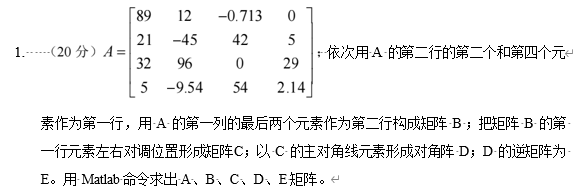
```matlab
%% 1
clc;clear;
A=[89 12 -0.713 0;21 -45 42 5;32 96 0 29;5 -9.54 54 2.14];
B=[A(2,2) A(2,4);A(end-1,1) A(end,1)];
C=[B(1,2) B(1,1);B(2,:)];
D=diag(diag(C));
E=inv(D);
```
## 2
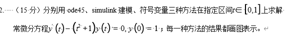
```matlab
%% 2
%符号变量
clc;clear;
syms y(t);
eqn=diff(y)==(t.^2+1).*y;
cond=y(0)==1;
f=dsolve(eqn,cond);

%ode45
clc;clear;
tspan=[0,1];
y0=1;
[t,y]=ode45(@(t,y)(t.^2+1).*y,tspan,y0);


%simulink  见ans2.slx
```
## 3
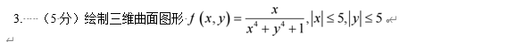
```matlab
%% 3
clc;clear;
x=linspace(-5,5,100);
y=linspace(-5,5,100);
[X,Y]=meshgrid(x,y);
f=X./(X.^4+Y.^4+1);
mesh(X,Y,f)

```
## 4
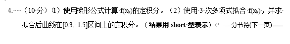
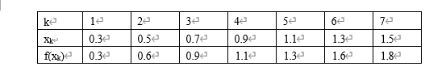
```matlab
%% 4
clc;clear;
format short;
k=1:7;
xk=0.3:0.2:1.5;
fk=[0.3	0.6	0.9	1.1	1.3	1.6	1.8];
%1
I=trapz(xk,fk);
%2
res=diff(polyval(polyint(polyfit(xk,fk,3)),[0.3,1.5]));
```
## 5
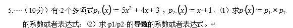
```matlab
%% 5
clc;clear;
p1=[5 4 3];
p2=[1 1];
%1
p=conv(p1,p2);
%2
[fenzi,fenmu]=polyder(p1,p2);

```
## 6
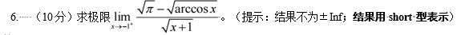
```matlab
%% 6
clc;clear;
syms x;
a=sym(pi);
f=(sqrt(a)-sqrt(acos(x)))/(sqrt(x+1));
eval(limit(f,x,-1,"right"))
```

## 7
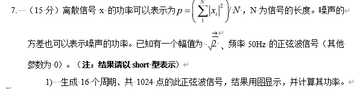

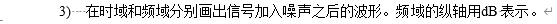
```matlab
%% 7
%1
clc;clear;
f=50;
T=1/f;
N=1024;
% x=linspace(0,16*T,N);
T0=0.32;%16个周期
fs=N/T0;
x=(0:N-1)/fs;
f=sqrt(2)*sin(2*pi*f*x);
scatter(x,f,".k");
p=sum(f.^2)/N;
%2
noise=(sqrt(p)/100)*randn(1,1024);
plot(1:N,noise);
p_noise=sum(noise.^2)/N;
s_n=10*log10(p/p_noise)
%3

scatter(x,f+noise);
F=fft(f+noise)*2/N;
f_x=fs*(0:N/2)/(N);
mag_F=abs(F(1:N/2+1));
plot(f_x,10*log10(mag_F));
```
## 8
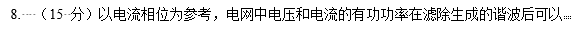
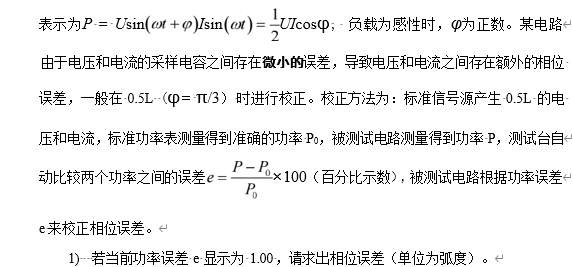
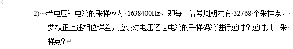
```matlab
%% 8
%1
clc;clear;
theta=pi/3;
e=0.01;
real_theta=acos((1+e)*cos(theta));
err=real_theta-theta;
%2
%若err大于0 cos为减函数 即theta>pi/3 theta=电压-电流
% 须使得theta减小，即使得更容性，需要延迟电压
%反之 err<0  delay I

if err > 0  
    disp("对电压采样进行延时");
elseif err < 0
    disp("对电流采样进行延时");
else 
    disp("均不需要进行延时");
end
delta=2*pi/32768;
N=ceil(abs(err)/delta);
disp(N)
```